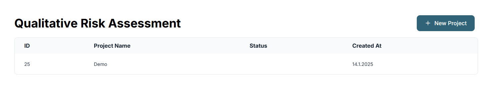
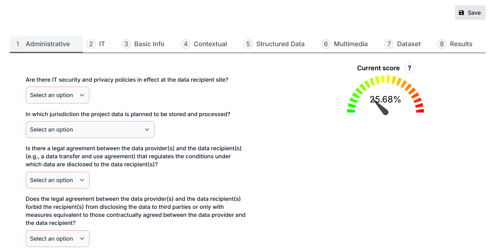
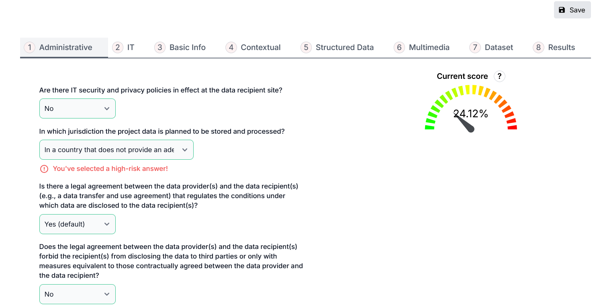
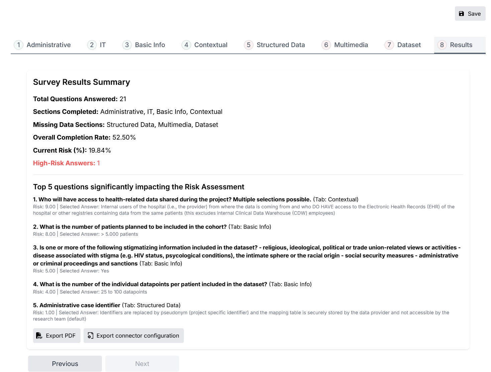
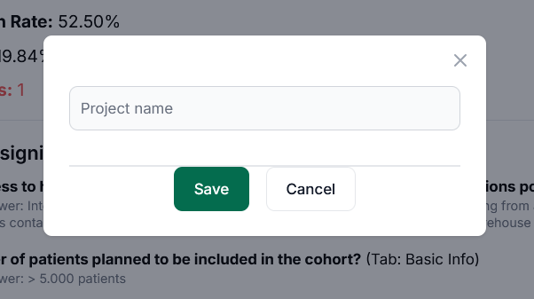

# Qualitative Risk Assessment
You can use the Qualitative Risk Assessment to assess the re-identification risk of a project in compliance with Swiss law requirements by going through a questionnaire.

## Steps and Process
### 1. **Project Dashboard**

- **Page View**: Displays a list of existing projects with the following columns:
  - **ID**: A unique identifier for the project
  - **Project Name**: The name given to the project
  - **Status**: Indicates the progress or completion of the assessment
  - **Created At**: Date when the project was created
- **Actions**: Click the **"New Project"** button to start a new qualitative risk assessment

### 2. **Questionnaire**

The qualitative risk assessment questionnaire is divided into 8 main sections, as shown by the navigation bar:
1. **Administrative**: Covers jurisdiction and agreements related to data storage and handling
2. **Basic Info**: General project information
3. **Contextual**: Information related to the context of data use
4. **Structured Data**: Specific details about structured datasets
5. **Multimedia**: Information about any multimedia content involved
6. **Dataset**: Details about the datasets in use
7. **IT**: Information related to IT infrastructure and security measures
8. **Results**: Displays the overall risk assessment results

Each section presents a series of questions. The **Current Score Gauge** is a visual representation of the current risk score in percentage. Green to red scale indicating low to high risk.

**High Risk Answer**: 

In the questionnaire, there are some answers marked as high-risk answers. When you receive a warning message indicating that you have selected a high-risk answer, your risk score will remain unchanged. However, in the summary, you will see a count of the high-risk answers. 

### 3. **Results Page**

- **Survey Results Summary**:
  - **Total Questions Answered**: Number of completed questions
  - **Sections Completed**: Overview of the completed and missing sections
  - **Overall Completion Rate**: Displays the percentage of completion
  - **Current Risk**: Shows the overall risk
  - **High-Risk Answers**: Highlights the number of answers contributing to significant risks
- **Export Options**:
  - Export the summary of the replied answers as **PDF**
  - Export the **connector configuration** to use for the SPHN connector

### 4. Save the project

After answering, you can save the project by giving it a name. You can also save the project at any point during the process and resume later.
